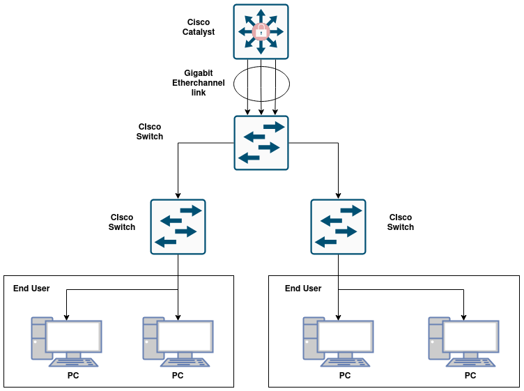

Berangkat dari masalah kabel putus dan segera untuk menyambungnya kembali dan melakukan konfigurasi sehingga jaringan up kembali?? tenang ada teknologi bernama etherchannel.

**EtherChannel Overview**
EtherChannel merupakan teknologi untuk melakukan aggregasi link dan port untuk menjaga high availability di sebuah sistem jaringan. Pemilihan protokol dan mode ketika konfigurasi etherchannel akan mempengaruhi kualitas jaringan/QoS.

Ibarat jalan tol yang memiliki banyak jalur lane maka jumlah kendaraan yang dapat melakukan perjalanan berbanding lurus dengan kapasitas jalan.

Gambar diatas merupakan visualisasi dari mengenai etherchannel. Etherchannel dapat dilihat pada jaringan link yang terhubung dari cisco catalyst hingga switch cisco dibawahnya, link terhubung dengan beberapa link sehingga dapat membentuk sebuah connection yang terhubung. Banyak link yang terhubung dapat meningkatkan availability dan fault tolerance ketika salah satu link terputus.

**Protokol etherchannel**
Etherchannel tidak hanya menambahkan jumlah kabel sehingga terbentuk menjadi sebuah etherchannel akan tetapi membutuhkan konfigurasi dengan beberapa jenis protokol didalamnya, antara lain:

1. **PAgP(Port Aggregation Protocol)**
   PAgP merupakan protokol yang hanya dimiliki oleh perangkat cisco saja, jika perangkat yang terhubung merupakan device dari cisco maka protokol ini dapat digunakan, jika bukan perangkat atau device cisco maka tidak dapat digunakan.

2. **LACP(Link Aggregation Control Protocol)**

Protokol LACP merupakan standard dari IEEE 802.3ad. LACP dapat menggabungkan hingga 16 link dalam satu etherchannel.
lebih fleksibel karena tidak tergantung oleh vendor atau vendor agnostik.
**Manfaat etherchannel**
Adapun manfaat dari penggunaan etherchannel yaitu:

1. Meningkatkan bandwidth dari sebuah jaringan yang terhubung antar perangkat.
2. Fault tolerance untuk meningkat high availability dari sebuah jaringan ketika sebuah link terputus ada backup link tanpa takut downtime.
3. Mengurangi perangkat perangkat yang mati karena link failure.

**Cara kerja etherchannel**
Cara kerja dari etherchannel dengan menggabungkan beberapa link fisik menjadi sebuah link intefaces logis yang disebut port channel.

Oleh karena jumlah link interfaces juga lah beban jaringan akan dibagi dan didistribusikan ke beberapa interfaces jaringan yang terhubung.

**Kesimpulan**
Kesimpulan dari tulisan artikel ini menggunakan etherchannel menggunakan protokol lacp atau pagp dapat membantu availability sebuah jaringan dan akan mengurangi fault tolerance dan link failure ketika ada link yang mati.

maaf karena di dalam artikel ini tidak membahas ke ranah teknis untuk konfigurasi karena author hanya fokus untuk belajar dan pengenalan mengenai etherchannel secara konsep saja.

Sumber:

1. https://www.cisco.com/c/en/us/td/docs/switches/lan/catalyst6500/ios/15-4SY/config_guide/sup6T/15_3_sy_swcg_6T/etherchannel.pdf

2. https://www.idn.id/etherchannel-gabungkan-kekuatan-beberapa-link-jadi-satu/
